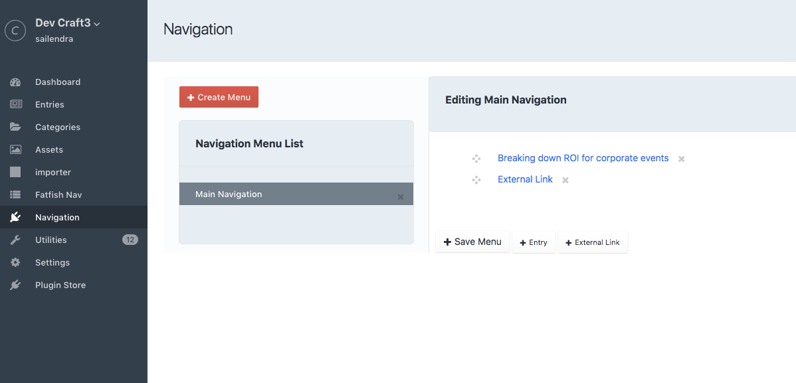

# Navigation plugin for Craft CMS 3.x

Craft navigation plugin for the website.

## Requirements

This plugin requires Craft CMS 3.0.0-beta.23 or later.

## Installation

To install the plugin, follow these instructions.

1. Open your terminal and go to your Craft project:

        cd /path/to/project

2. Then tell Composer to load the plugin:

        composer require https://github.com/fatfishdigital/navigation

3. In the Control Panel, go to Settings → Plugins and click the “Install” button for Navigation.

## Navigation Overview

Navigation is simple menu builder for Craft CMS 3.x

   

## Templating 

**craft.Navigation.render()**

craft.Navigation.render() lets you build menu with inbuilt html. It takes two parameter which are Menu Name (menuhandle)

and menu styling option (style option is optional). 
    
        {{craft.Navigation.render('Footer Nav',{ulClass:'topnav',activeClass:'active'})}}

Navigation menu also lets you build your menu using custom html, This will entirely based on your own html and css,

you can use it via twig macro. 

Inorder to achieve this you need to use **craft.Navigation.getRawNav(MenuName)** 

This will let you build your own html menu with twig macro. Below is twig macro code which will help you to build your menu.

    
    
        
        
        
            <ul>
                
                    <li>
                        <a href="/{{craft.entries.id(grandchildren.NodeId).one().uri}}{{ grandchildren.menuUrl }}  ">{{ grandchildren.NodeName }}</a>
                        {{ macros.menu(grandchildren.NodeId) }}
                    </li>
                
            </ul>
        
    
    
    
    <ul>
    
       
            
    
                
    
                       
    
                           
                               <li>
    
                                   <a href="/{{craft.entries.id(MenuNode.NodeId).one().uri}}{{ MenuNode.menuUrl }}  ">{{ MenuNode.NodeName }}</a>
                                  
                                 
                                   <ul>
                                      
                                          <li>
                                              <a href="/{{craft.entries.id(childrenMenu.NodeId).one().uri}}{{ childrenMenu.menuUrl }}  ">{{ childrenMenu.NodeName }}</a>
                                              {{ macros.menu(childrenMenu.NodeId) }}
    
                                          </li>
                                       
    
                                   </ul>
                                     
                               </li>
                               
    
                            
                    
                    
    
                
                
    
     
    </ul>

Brought to you by [Fatfish](https://fatfish.com.au)
