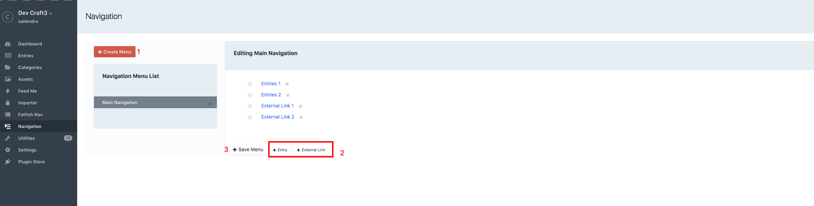

# Navigation plugin for Craft CMS 3.x

Craft navigation plugin for the website.

## Requirements

This plugin requires Craft CMS 3.0.0-beta.23 or later.

## Installation

To install the plugin, follow these instructions.

1. Open your terminal and go to your Craft project:

        cd /path/to/project

2. Then tell Composer to load the plugin:

        composer require fatfish/navigation

3. In the Control Panel, go to Settings → Plugins and click the “Install” button for Navigation.

## Navigation Overview

Navigation is a simple menu builder for Craft CMS 3.x

   
   
   1. Click on create Menu, Give your menu a name.
   2. Choose your entries by clicking on entry button or click on external link if you want add external link
   3. Save Menu 
   
   Voila you are done !.

## Templating 

**craft.Navigation.render()**

craft.Navigation.render() lets you build a menu with pre-built static templates. This function takes two parameters, menu name "menu_name" and menu styling options.

Menu style options contains arrays which have a 'div', 'ul', 'li', and 'a' element. Each element can have their own CSS class.
    
        {{craft.Navigation.render('menu_name',{  wrapperClass : 'navbar',
                                                   ulClass: 'navbar-nav',
                                                   listClass: 'nav-item',
                                                   linkClass: 'nav-link'})}}

This plugin also lets you build menus using your own HTML and CSS, 
you can use it via Twig Macro. 

Inorder to achieve this you need to use **craft.Navigation.getRawNav(MenuName)** 

This will let you build your own HTML menu with Twig Macros. 

Sample custom menu:

    
    
        
        
        
            <ul>
                
                    <li>
                        <a href="/{{craft.entries.id(grandchildren.NodeId).one().uri}}{{ grandchildren.menuUrl }}  ">{{ grandchildren.NodeName }}</a>
                        {{ macros.menu(grandchildren.NodeId) }}
                    </li>
                
            </ul>
        
    
    
    
    <ul>
    
       
            
    
                
    
                       
    
                           
                               <li>
    
                                   <a href="/{{craft.entries.id(MenuNode.NodeId).one().uri}}{{ MenuNode.menuUrl }}  ">{{ MenuNode.NodeName }}</a>
                                  
                                 
                                   <ul>
                                      
                                          <li>
                                              <a href="/{{craft.entries.id(childrenMenu.NodeId).one().uri}}{{ childrenMenu.menuUrl }}  ">{{ childrenMenu.NodeName }}</a>
                                              {{ macros.menu(childrenMenu.NodeId) }}
    
                                          </li>
                                       
    
                                   </ul>
                                     
                               </li>
                               
    
                            
                    
                    
    
                
                
    
     
    </ul>

Brought to you by [Fatfish](https://fatfish.com.au)
